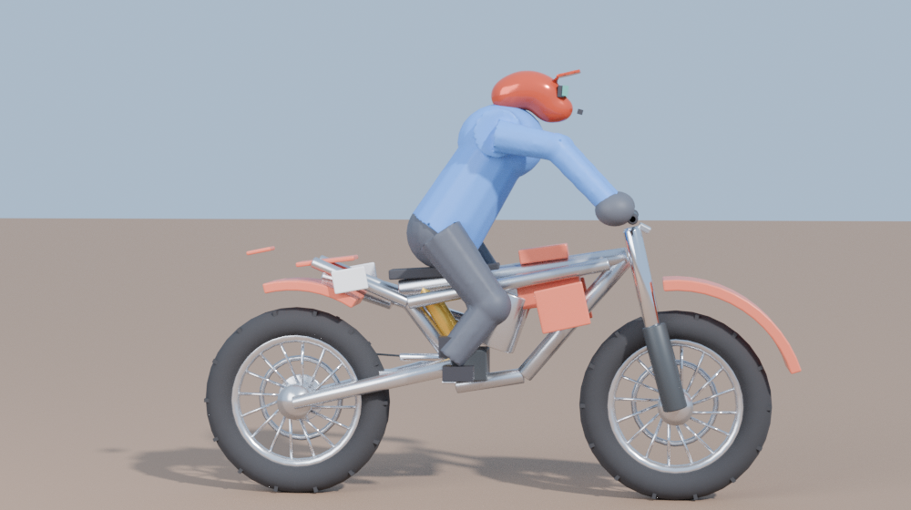

# MotoRush (iOS)

Native SwiftUI + SpriteKit motocross game. Landscape, iOS 16+, no third-party
frameworks and no image assets — every bike, rider, track and effect is drawn
from procedural geometry at runtime.

## Build

Open `MotoRush.xcodeproj` in Xcode and run, or let CI do it: every push to this
branch runs `.github/workflows/build-ipa.yml`, which builds with
`CODE_SIGNING_ALLOWED=NO` and publishes **`MotoRush-unsigned.ipa`** to the
repo's `latest` release. Download it and sign on-device with your sideloading
tool of choice.

## Screens

- **Career** — region qualifiers (Copper Basin → World Arena), each with eight
  track cards. A card unlocks when every earlier card in the region has a
  medal; a region opens when the previous one is half cleared. Cards show the
  recommended power against your bike's current rating, medals earned, and the
  daily goal sits in the corner.
- **Weekly Jam** — one solo track seeded from the ISO week, rotating every
  Monday, with its own personal best and ghost. Sits at the head of the career
  row.
- **Race** — gate drop with rider name labels over the pack, then a physics
  race with speedo, live standings, style score and touch controls
  (throttle, brake, lean back/forward, whip left/right). Your best run on each
  track is recorded and replayed as a translucent **ghost** with a live +/-
  gap in the HUD; an **instant restart** button rebuilds the race at the gate
  without leaving the track.
- **Podium** — top three on the blocks, run stats, coins, XP and the trophy
  swing, with the daily goal ticking over.
- **Trophies** — eight divisions (Dirt → Factory). Podium finishes pay,
  the back of the pack costs, and beating your ghost is worth as much as a
  win. The division badge sits in the career top bar.
- **Garage / Rider / Settings** — bikes, six upgrade lines, name and number,
  haptics and landing assist.

## Art

The race renders in SceneKit. The simulation is unchanged — still a side-on
plane, which is what keeps the handling readable — but it is presented in 3D:

- `tools/blender_assets.py` builds every model procedurally in Blender and
  exports OBJ+MTL into `MotoRush/Art`. Rebuild with
  `blender --background --python tools/blender_assets.py`, and preview the
  result with `blender --background --python tools/preview.py -- out.png`.
- Parts are laid out around shared anchors (`Rig` in the script, `Rig` in
  `Race3D.swift`): the fork model's origin is the front axle, the swingarm's
  is its pivot, so the renderer can drop each part straight onto the solved
  suspension positions.
- The rider is built from metaballs and voxel-remeshed per material group, so
  the helmet and limbs are continuous surfaces rather than a pile of
  primitives. Wheels are torus carcasses with laced spokes; fenders are swept
  panels.
- The track is extruded at runtime from the same heightfield into a banked
  ribbon with raised lips and an outer skirt, lit by a directional sun with
  deferred shadows, ambient fill, depth fog and HDR bloom.

## Code

| File | What it is |
| --- | --- |
| `Track.swift` | Seeded procedural generator: tabletops, doubles, triples, step-ups/downs, whoops, rollers, rhythm sections, berms, across 12 biomes |
| `Physics.swift` | Rigid chassis + two raycast suspension units, friction-circle tyres, rider weight transfer, air control, whip/scrub, landing quality, verlet ragdoll |
| `AI.swift` | Six personalities with ballistic landing prediction, skill-scaled reaction delay and real mistakes — same physics, same inputs as the player |
| `RaceScene.swift` | SpriteKit renderer, gate drop, parallax, particles, dynamic camera |
| `Model.swift` | Bikes, upgrades, regions, medals, daily goal, persistence |
| `CareerView` / `PodiumView` / `GarageView` / `Theme` | SwiftUI menus |

Physics and track generation are ports of the browser build in `../MotoRush`,
so tuning notes there apply here: units are metres/kilograms/seconds, thrust
falls off as `(1 − v/topSpeed)`, and `onLanding()` owns the whole risk/reward
loop.

## Not implemented

Single-player only. Ghosts are your own runs stored on-device — there is no
server, so no downloading other riders' ghosts, no matchmaking and no global
leaderboards. Races are one-lap sprints. There is no audio in this build (the
browser version has the full procedural sound engine).

All content is original. No third-party assets, track layouts, logos or
branding are used anywhere in this project.
